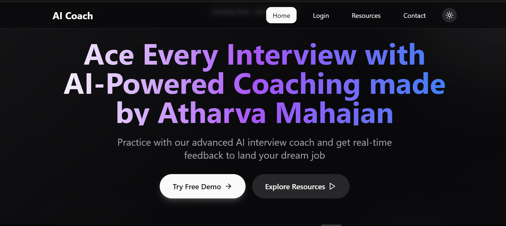
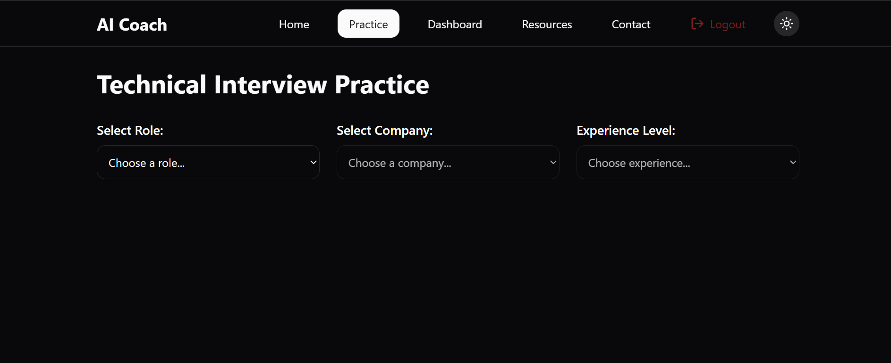
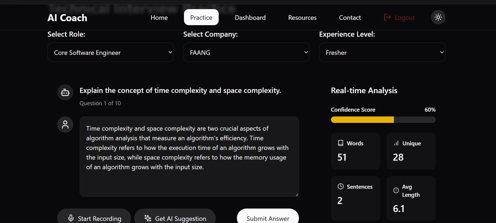
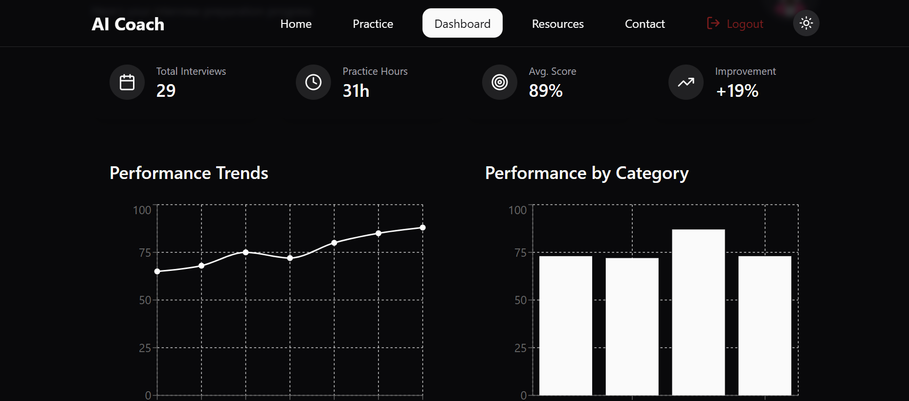
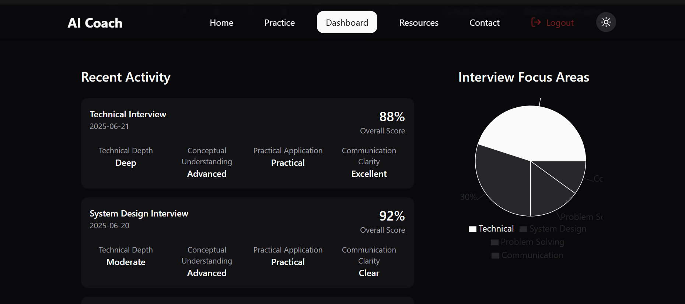
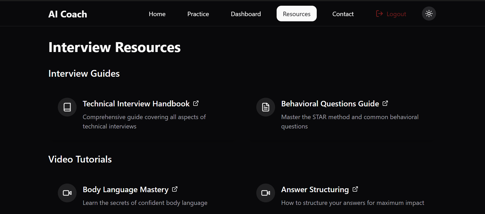

## 🏠 Home Page

The Home Page is where first impressions are made — and this one delivers.

⚡ Minimal. Intelligent. Engaging.  
🎯 Highlights the platform’s core mission: AI-powered interview prep.  
🖱️ Features a bold call-to-action to begin coaching instantly.  
📱 Fully responsive with sleek animations and zero clutter.  

> A landing page that doesn’t just welcome — it inspires action.

## 🧠 Practice Page

Simplicity meets precision.

🧩 A clean, intuitive form lets users select:
- 🎯 Desired Role  
- 🏢 Target Company  
- 📊 Experience Level  

🧠 Based on these choices, tailored interview questions are generated in real-time.  
🎙️ Users can respond via **text** or even **voice**, thanks to integrated speech handling.

> Designed for flow — minimal clicks, maximum learning.

## 🧠 Answer Analysis

Where preparation turns into precision.

After the user submits their answer — whether typed or spoken — **AI Coach** breaks it down using multiple intelligent criteria:

- 📊 **Confidence Score** – Estimates how confidently the user answered.
- 🧠 **Concepts Covered** – Lists all the key concepts you successfully addressed.
- ❌ **Missed Concepts** – Reveals crucial topics or keywords you skipped.
- 💬 **Unique Words Used** – Tracks how diverse and rich your vocabulary was.
- 🧾 **AI-Generated Feedback** – Smart, personalized tips for improving your response.
- 🤖 **Model Answer** – Instantly see how the AI would have answered the same question.

> It's not just evaluation — it's evolution.

  
  
## 📊 Dashboard

Your progress — visualized with precision.

The **AI Coach Dashboard** is your personal command center to monitor and optimize your interview journey. It turns raw performance data into clean, intuitive visuals that help you stay focused and grow faster.

### ✨ Highlights:
- 📈 **Performance Trends** – Visual graphs that reveal how you're improving over time.
- 🧩 **Categorical Insights** – Understand your strengths and weaknesses across different interview topics.
- 🎯 **Focus Areas** – Smart suggestions on what to revise based on your past answers.
- ⏱️ **Total Practice Time** – Track how much time you’ve invested in getting better.
- 🧠 **AI-Driven Highlights** – Dynamic summaries of your overall progress.

> From effort to evolution — the dashboard makes your growth visible.

## 📚 Resources

Your personal toolkit for interview mastery.

The **Resources** page is thoughtfully curated to give you everything you need to upskill and stay ahead. Whether you're just starting or looking to polish your expertise, this page offers a collection of premium material designed to help you grow.

### 🛠️ What You’ll Find:
- 📄 **Curated Articles** – Expert-written guides on interview techniques, body language, mindset, and more.
- 🎥 **Video Resources** – Handpicked video content explaining key concepts, soft skills, and real interview breakdowns.
- 🧠 **Concept Boosters** – Micro-lessons and concept refreshers to strengthen your technical foundation.
- 📘 **Cheat Sheets & Templates** – Quick references to revise before interviews.

> One page. Endless prep power.

---

